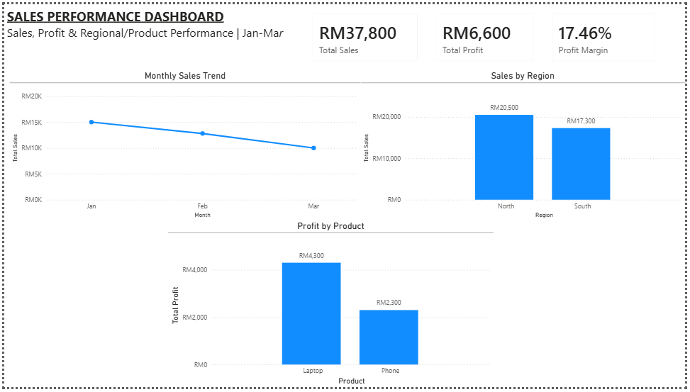

# Sales Performance Dashboard

## Project Overview

This project analyses sales and profitability performance across different months, regions, and products.

The objective is to help management understand sales trends, compare regional performance, evaluate product profitability, and identify areas that may require further investigation.

## Tools Used

- Microsoft Excel
- Power BI
- DAX

## Dashboard Preview

## Key Performance Indicators

| KPI | Result |
|---|---:|
| Total Sales | RM37,800 |
| Total Profit | RM6,600 |
| Overall Profit Margin | 17.46% |

## Key Findings

### 1. Declining Sales and Profit Trend

Total sales and profit showed a declining trend from January to March. This indicates that the company should investigate the factors contributing to the downward trend.

### 2. Regional Performance

North generated higher total sales and total profit than South. However, South achieved a higher profit margin, indicating better profitability efficiency.

- North Sales: RM20,500
- North Profit: RM3,500
- North Profit Margin: 17.07%

- South Sales: RM17,300
- South Profit: RM3,100
- South Profit Margin: 17.92%

### 3. Product Performance

Laptop generated higher total profit and profit margin than Phone based on the current dataset.

- Laptop Profit: RM4,300
- Laptop Profit Margin: 18.07%

- Phone Profit: RM2,300
- Phone Profit Margin: 16.43%

## Recommendations

### 1. Monitor the Declining Trend

The company should closely monitor monthly sales and profit trends over the next three months. If the downward trend continues, management should investigate the underlying causes and take appropriate corrective actions.

### 2. Investigate Product and Regional Profitability

The company should continue monitoring Phone and South region performance rather than discontinuing them immediately. Management should investigate the key cost drivers and sales factors before making major product or regional decisions.

## Skills Demonstrated

- Data preparation using Excel
- Profit calculation
- Pivot Table analysis
- Data visualization
- Power BI dashboard development
- DAX measures
- KPI development
- Trend analysis
- Regional and product comparison
- Profit margin analysis
- Business insights and recommendations
